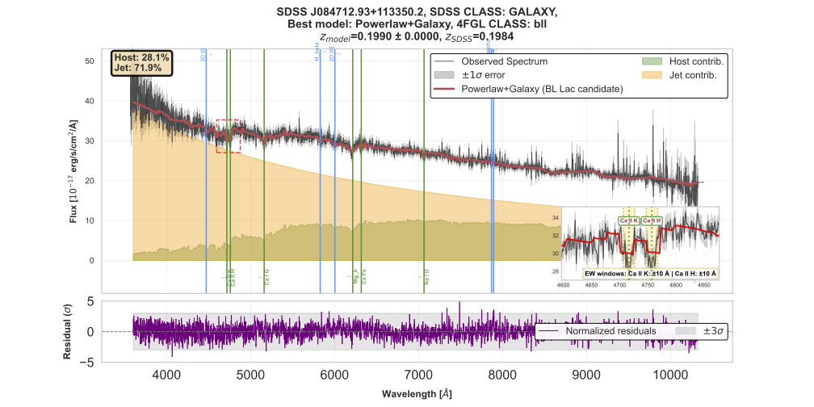

# Blazar Analysis Pipeline

Plotting and analysis utilities for the multi-component spectral fitting pipeline developed in:

> **Nlowie et al. (in prep.)** — *Optical Spectroscopic Analysis of Fermi Detected Blazars using SDSS-V*

---

## What are blazars?

Blazars are a class of Active Galactic Nuclei (AGN) with relativistic jets pointed directly toward the observer. They are among the most energetic objects in the Universe and are detected across the electromagnetic spectrum — from radio waves to gamma rays. Blazars are broadly divided into two subclasses:

- **BL Lacertae objects (BL Lacs)** — jet-dominated spectra with weak or absent emission lines, making redshift measurement extremely challenging
- **Flat Spectrum Radio Quasars (FSRQs)** — jet emission coexisting with broad emission lines and accretion disc continuum from the broad-line region (BLR)

The automated SDSS spectroscopic pipeline systematically misclassifies blazars as Galactic stars because it lacks a non-thermal jet continuum component in its template library. This pipeline corrects that by explicitly modelling the jet contribution.

---

## What this pipeline does

The pipeline fits six physically motivated spectral model families to optical BOSS spectra of Fermi-LAT blazar candidates cross-matched with SDSS-V DR20:

| Model | Physical interpretation | Blazar class |
|-------|------------------------|--------------|
| Galaxy | Passive elliptical host galaxy only | — |
| QSO | Accretion disc + broad emission lines only | — |
| Powerlaw | Featureless non-thermal jet continuum | BL Lac candidate |
| Powerlaw + Galaxy | Jet + host galaxy | BL Lac candidate |
| Powerlaw + QSO | Jet + accretion disc/BLR | FSRQ candidate |
| Powerlaw + Lines | Jet + emission lines only | FSRQ candidate |

Model selection uses the corrected Akaike Information Criterion (AICc), which penalises model complexity to prevent overfitting. Redshifts are estimated from a Bayesian posterior constructed by marginalising over template uncertainty within each family and combining families with equal priors, evaluated over a logarithmic grid z = 0.01–5.0.

The pipeline measures:
- **Optical jet fraction** — the fraction of total optical flux attributable to the non-thermal jet
- **Spectroscopic redshift** — from the maximum a posteriori (MAP) estimate with local lmfit refinement
- **Equivalent widths** — for 16 emission and absorption features using adaptive window selection
- **Power-law continuum parameters** — spectral slope α and curvature δ

---

## Repository structure

```
Blazar-Analysis-Pipeline/
├── blazarkit.py   ← all plotting, EW measurement, and cache utilities
├── demo.py              ← worked examples showing how to use the pipeline
├── requirements.txt     ← Python dependencies
├── example_pipeline.png ← example spectral decomposition plot
└── README.md
```

---

## Getting started

### 1. Install dependencies

```bash
pip install -r requirements.txt
```

Dependencies: `numpy`, `matplotlib`, `astropy`, `scipy`

### 2. Download the cache

The pre-computed fitting results (746 sources, ~XX GB) are available on Zenodo:

> **DOI: to be added upon publication**

Download and place the `Fits_with_Native_resampling_cache/` folder in the same directory as the scripts.

### 3. Run the demo

Open `demo.py` in your preferred environment (Jupyter, VSCode, or any IPython interface) and run the cells.

Or convert to a Jupyter notebook:

```bash
pip install jupytext
jupytext --to notebook demo.py
jupyter notebook demo.ipynb
```

---

## Quick start

```python
from blazarkit import RedshiftResultsCache, plot_from_cache

# Initialise cache
cache = RedshiftResultsCache(cache_dir='Fits_with_Native_resampling_cache')

# Load a source by SDSS_ID and MJD
# (check the cache directory for filenames in the format obj_{SDSS_ID}_{MJD}.pkl.gz)
results = cache.load_object_results('79336239', mjd=59955)

# Plot all diagnostic panels with defaults
fig1, fig2 = plot_from_cache(results)
```

---

## Sample output



**Figure description:** Multi-component optical spectral decomposition of a Fermi-detected blazar. The Powerlaw+Galaxy model (red) separates the jet contribution (orange shading) from the host galaxy (green shading). The zoom inset identifies Ca II H&K absorption features used to anchor the redshift solution. The lower panel shows normalised residuals.

---

## Function reference

### `plot_from_cache`

```python
plot_from_cache(results, save_dir=None,
                show_fig1=True,
                show_fig2=True,
                show_inset=True,
                show_residuals=True,
                show_components=True,
                show_line_markers=True,
                show_fraction_label=True,
                models_to_show='best',
                wavelength_range=(3600, 10400),
                ylim=None)
```

| Parameter | Default | Description |
|-----------|---------|-------------|
| `results` | — | Dict from `cache.load_object_results()` |
| `save_dir` | `None` | Directory to save PDF; if None, not saved |
| `show_fig1` | `True` | Show χ²(z) and p(z) diagnostic figure |
| `show_fig2` | `True` | Show best-fit spectrum figure |
| `show_inset` | `True` | Show zoom insets for detected lines only |
| `show_residuals` | `True` | Show normalised residuals panel |
| `show_components` | `True` | Show shaded host/jet component fills |
| `show_line_markers` | `True` | Show emission/absorption line markers |
| `show_fraction_label` | `True` | Show Host/Jet percentage text box |
| `models_to_show` | `'best'` | `'best'`, `'all'`, or a list of model names |
| `wavelength_range` | `(3600, 10400)` | Wavelength range in Å |
| `ylim` | `None` | Override automatic y-axis limits as `(y_min, y_max)` |

**Examples:**

```python
# Only the spectrum, no chi2 figure
fig1, fig2 = plot_from_cache(results, show_fig1=False)

# Show all model fits overlaid
fig1, fig2 = plot_from_cache(results, models_to_show='all')

# Zoom into a specific wavelength range
fig1, fig2 = plot_from_cache(results, wavelength_range=(4000, 7000))

# Show specific models only
fig1, fig2 = plot_from_cache(results,
                              models_to_show=['Powerlaw+Galaxy', 'Galaxy'])

# Minimal clean plot — best model only, no extras
fig1, fig2 = plot_from_cache(results, show_fig1=False,
                              show_inset=False,
                              show_line_markers=False,
                              show_residuals=False)

# Override y-axis limits
fig1, fig2 = plot_from_cache(results, ylim=(-2, 30))
```

---

### `RedshiftResultsCache`

```python
cache = RedshiftResultsCache(cache_dir='Fits_with_Native_resampling_cache')

# Load a source
results = cache.load_object_results(sdss_id, mjd=mjd)

# Check if a source exists in cache
cache.exists(sdss_id, mjd=mjd)

# List all cached sources
cache.list_cached_objects()
```

---

### `compute_EW_for_all_lines`

```python
results_ew = compute_EW_for_all_lines(wave, flux, err, fit_mask, z)
```

Returns a list of tuples: `(name, obs_wave, ew, ew_err, snr, detected, ltype, window)` for all 16 spectral features. A line is considered detected if `S/N >= 3`.

---

## Cache structure

Each cache file is a compressed pickle (`.pkl.gz`) containing a dictionary with the following keys:

```
results
├── metadata       — SDSS_ID, MJD, z_sdss, obj_class, fermi_class, ...
├── spectrum       — common_wave, flux_resamp, err_resamp, x_fit, y_fit, e_fit, fit_mask
├── chi2_grids     — z_grid, chi2_gal_list, chi2_qso_list, chi2_galpl_list, ...
├── pz_results     — pz_gal, pz_qso, pz_galpl, ..., p_total, z_map_total, C_global
├── lmfit_results  — best_label, z_best, z_err, best_fit_params, pl_alpha, pl_delta, ...
├── components     — galpl_contrib, qsopl_contrib, linepl_contrib (jet fractions)
├── ew_results     — equivalent width measurements for all 16 lines
└── config         — pipeline settings (IGM model, AICc flag, template counts, ...)
```

---

## Spectral line list

The pipeline measures equivalent widths for the following features:

**Emission lines:** Ly α, C IV, C III], Fe II, Mg II, [O II], H β, [O III], H α, [N II]

**Absorption lines:** Ca II K, Ca II H, Ca I G, Mg b, Na I D, Ca Fe

---

## Installation troubleshooting

**`ModuleNotFoundError: No module named 'scipy'`**
```bash
pip install scipy
```

**`FileNotFoundError: No cache found`**
Check that the cache directory path is correct and the file exists in the format `obj_{SDSS_ID}_{MJD}.pkl.gz`.

**Plots not showing in Jupyter**
Add `%matplotlib inline` at the top of your notebook.

**Inset panels not appearing**
Zoom insets only appear for lines with `S/N >= 3`. If no lines are detected the insets will not be shown. You can verify detected lines by running `compute_EW_for_all_lines` directly.

---

## Citation

If you use this code or the associated catalogue, please cite:

```
Nlowie et al. (in prep.) — Optical Spectroscopic Analysis of Fermi Detected Blazars using SDSS-V
```

---

## Contact

Mohammed Iddrisu Nlowie (m.i.nlowie@sms.ed), Prof. James Aird (james.aird@ed.ac.uk), Dr. Eli Kasai(ekasai@unam.na) 
University of Edinburgh / Royal Observatory of Edinburgh
Funded by the Development in Africa with Radio Astronomy (DARA) programme
