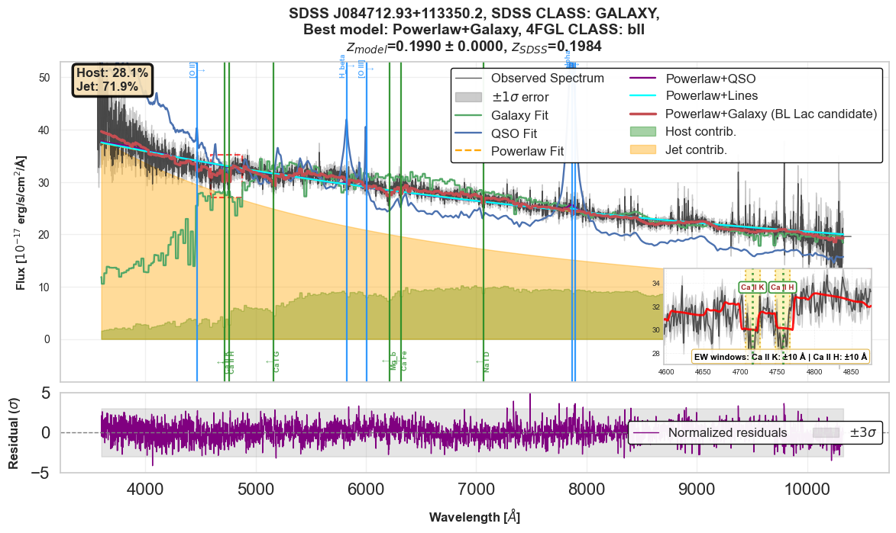

# blazarkit

**blazarkit** is a Python package for visualising and analysing pre-computed spectral fitting results from the Fermi/SDSS-V Blazar Analysis Pipeline.

> **Nlowie et al. (in prep.)** — *Optical Spectroscopic Analysis of Fermi Detected Blazars using SDSS-V*

---

## What are blazars?

Blazars are a rare and extreme subclass of radio-loud Active Galactic Nuclei (AGN) — supermassive black holes at the centres of distant galaxies that launch relativistic plasma jets pointed almost directly toward Earth. This near-perfect alignment causes the jet emission to be Doppler boosted by factors of tens to hundreds, making blazars among the most luminous persistent sources of radiation in the Universe across the full electromagnetic spectrum, from radio waves to gamma rays.

Blazars are divided into two observationally distinct subclasses:

- **BL Lacertae objects (BL Lacs)** — featureless or nearly featureless optical spectra dominated by the non-thermal synchrotron jet continuum, with weak or absent emission lines, making spectroscopic redshift measurement extremely challenging
- **Flat Spectrum Radio Quasars (FSRQs)** — broad emission lines from the broad-line region (BLR) and a thermal accretion disc continuum coexist with the jet emission, placing them at systematically higher redshifts and luminosities than BL Lacs

Understanding the blazar population is important for understanding jet formation, the blazar sequence, AGN feedback, and the origins of ultra-high-energy cosmic rays and high-energy neutrinos.

---

## Why a new classification method?

The SDSS automated spectroscopic pipeline classifies spectra into STAR, GALAXY, or QSO using a template library without accounting for the non-thermal jet component. This causes systematic misclassification of blazars — particularly BL Lacs, which are assigned STAR classifications because their featureless power-law continua resemble stellar spectra. FSRQs may be correctly identified as QSOs but without any separation of the jet contribution from the thermal emission.

Our pipeline corrects this by fitting each BOSS spectrum with six physically motivated model families that explicitly include a flexible non-thermal power-law continuum alongside galaxy, QSO, and emission-line templates. Model selection uses the corrected Akaike Information Criterion (AICc) to identify the physically appropriate model for each source, enabling reliable blazar classification, spectroscopic redshift measurement, and decomposition of the optical emission into jet and thermal contributions.

For full details of the method, see **Nlowie et al. (in prep.)**.

| Model | Physical meaning | Blazar class |
|-------|-----------------|--------------|
| Galaxy | Passive elliptical host galaxy | BL Lac candidate (No physically motivated PL needed) |
| QSO | Accretion disc + broad emission lines | FSRQ candidate (No physically motivated PL needed)  |
| Powerlaw | Featureless non-thermal jet continuum | BL Lac |
| Powerlaw + Galaxy | Jet + host galaxy | BL Lac candidate |
| Powerlaw + QSO | Jet + accretion disc/BLR | FSRQ candidate |
| Powerlaw + Lines | Jet + emission lines only | FSRQ candidate |

**PL  -- Powerlaw**. 

---

## The Value-Added Catalogue (VAC)
The pipeline was applied to 707 Fermi-LAT blazar candidates cross-matched with SDSS-V DR20. The results are published as a Value-Added Catalogue (VAC) through the SDSS Science Archive Server (SAS):

> **SDSS-V DR20 VAC: to be added upon publication**
> https://data.sdss.org/sas/dr20/

The VAC contains one row per source with columns including:

| Column | Description |
|--------|-------------|
| `SDSS_ID` | Unique SDSS-V source identifier |
| `FGL_NAME` | Fermi 4FGL source name |
| `FGL_CLASS` | Fermi classification (BLL, FSRQ, BCU) |
| `BEST_MODEL` | Best-fit spectral model |
| `SDSS_CLASS` | Original SDSS classification |
| `Z_fit` | Pipeline spectroscopic redshift |
| `Z_fit_err` | Redshift uncertainty |
| `Jet_Fraction` | Optical jet fraction |
| `PL_alpha` | Power-law continuum slope |
| `PL_delta` | Power-law curvature |
| `SNR` | Spectral signal-to-noise ratio |

The VAC alone allows straightforward population-level analysis — redshift distributions, jet fraction comparisons, power-law slope statistics — without needing to load individual spectra. See the **demo notebook** for worked examples.

---

## What is blazarkit?

**blazarkit** is the companion Python package to the VAC. While the VAC gives you the tabulated results, blazarkit lets you go deeper — loading the full pre-computed spectral fitting results for any source and visualising the complete spectral decomposition.

### What blazarkit gives you

- **Spectral decomposition plots** — observed spectrum with best-fit model, jet/host component shading, spectral line markers, and zoom insets on key detected features
- **Redshift diagnostic plots** — χ²(z) curves and p(z) posteriors for all six model families
- **Equivalent width measurements** — for 16 emission and absorption features with adaptive window selection
- **Classification summary** — one-line human-readable description of each source
- **EW summary plot** — bar chart of all detected lines with S/N labels
- **Population plots** — jet fraction vs redshift, power-law slope distributions
- **Raw fit parameters** — direct access to all cached fitting results

### The relationship between the VAC and blazarkit

The VAC and blazarkit complement each other:

- **VAC** → population-level analysis, source selection, simple diagnostic plots using tabulated parameters
- **blazarkit** → source-level analysis, full spectral visualisation, equivalent width measurement, detailed inspection of individual fits

A typical workflow starts with the VAC to identify sources of interest, then uses blazarkit to inspect those sources in detail.

---

## Installation

### Requirements
- Python 3.7 or higher
- Works on Mac, Windows, and Linux

### Install blazarkit

```bash
pip install git+https://github.com/minlowie/Blazar-Analysis-Pipeline.git
```

### Install dependencies manually (if needed)

```bash
pip install numpy matplotlib astropy scipy
```

---

## Getting the data

### The cache

blazarkit works with pre-computed spectral fitting results stored as compressed cache files. Files stream automatically on first use and are saved locally for all future calls — no account or authentication required.

```python
cache   = NAKBlaZarCache()
results = cache.load('20570296', mjd=60027)
# First call: streams from Dropbox and saves to blazar_cache/
# All future calls: loads instantly from local storage
```

The cache will be permanently archived on Zenodo upon publication of SDSS-V DR20, after which it will also stream directly from Zenodo. In the meantime, contact **m.i.nlowie@sms.ed.ac.uk** if you experience any access issues.

---

## Quick start

```python
from blazarkit import NAKBlaZarCache, bz_inspect
from astropy.table import Table
from astropy.io import fits

# Step 1 — Load the VAC to browse sources or see demo to access from the SDSS server
vac = Table(fits.open('fermi_blazar_vac.fits')[1].data)
print(f'VAC: {len(vac)} sources')


# Step 2 — Initialise the cache
cache = NAKBlaZarCache()

# Step 3 — Load a source by SDSS_ID and MJD (from the VAC)
results = cache.load('20570296', mjd=60027)

# Step 4 — Plot the spectral decomposition
fig1, fig2 = bz_inspect(results, model='best')
```

---

## Sample output



**Figure description:** Multi-component optical spectral decomposition of a Fermi-detected BL Lac candidate. The Powerlaw+Galaxy model (red) separates the jet contribution (orange shading) from the host galaxy (green shading). The inset zooms in on the Ca II H&K absorption doublet used to anchor the redshift. The lower panel shows normalised residuals.

---

## Usage examples

```python
from blazarkit import NAKBlaZarCache, bz_inspect

cache   = NAKBlaZarCache()
results = cache.load('20570296', mjd=60027)

# Best model only
fig1, fig2 = bz_inspect(results, model='best')

# All model fits overlaid
fig1, fig2 = bz_inspect(results, model='all')

# Specific models
fig1, fig2 = bz_inspect(results, model=['best', 'Powerlaw+QSO'])

# Also show chi2/p(z) figure
fig1, fig2 = bz_inspect(results, model='best', show_fig1=True)

# Minimal clean plot
fig1, fig2 = bz_inspect(results, model='best',
                         show_inset=False,
                         show_line_markers=False,
                         show_residuals=False)

# Zoom into a wavelength range
fig1, fig2 = bz_inspect(results, model='best', wavelength_range=(4000, 7000))

# Override y-axis limits
fig1, fig2 = bz_inspect(results, model='best', ylim=(-2, 30))

# Save to PDF
fig1, fig2 = bz_inspect(results, model='best', save_dir='my_plots')
```

---

## Function reference

### `bz_inspect`

```python
bz_inspect(results, model,
           save_dir=None,
           show_fig1=False,
           show_fig2=True,
           show_inset=True,
           show_residuals=True,
           show_components=True,
           show_line_markers=True,
           show_fraction_label=True,
           wavelength_range=(3600, 10400),
           ylim=None)
```

| Parameter | Default | Description |
|-----------|---------|-------------|
| `results` | — | Dict from `cache.load()` |
| `model` | required | `'best'`, `'all'`, or list e.g. `['Powerlaw+Galaxy', 'Powerlaw+QSO']` |
| `save_dir` | `None` | Directory to save PDF; if None, not saved |
| `show_fig1` | `False` | Show χ²(z) and p(z) diagnostic figure |
| `show_fig2` | `True` | Show best-fit spectrum figure |
| `show_inset` | `True` | Show zoom insets for detected lines only |
| `show_residuals` | `True` | Show normalised residuals panel |
| `show_components` | `True` | Show shaded host/jet component fills |
| `show_line_markers` | `True` | Show emission/absorption line markers |
| `show_fraction_label` | `True` | Show Host/Jet percentage text box |
| `wavelength_range` | `(3600, 10400)` | Wavelength range in Å |
| `ylim` | `None` | Override automatic y-axis limits as `(y_min, y_max)` |

---

### `NAKBlaZarCache`

```python
# Initialise — streams automatically, saves locally
cache = NAKBlaZarCache()

# Or point to an existing local folder
cache = NAKBlaZarCache(cache_dir='/path/to/your/cache')

# Load a source — streams on first call, instant on subsequent calls
results = cache.load(sdss_id, mjd=mjd)

# Check if a source exists locally
cache.exists(sdss_id, mjd=mjd)

# List locally cached sources
cache.list_cached_objects()
```

`load()` checks in this priority order:
1. Local cache — instant
2. Zenodo — when DOI is confirmed after DR20 public release
3. Dropbox — available now, no authentication required
4. Google Drive — additional fallback

---

### `measure_ew`

```python
results_ew = measure_ew(wave, flux, err, fit_mask, z)
```

Returns a list of tuples `(name, obs_wave, ew, ew_err, snr, detected, ltype, window)` for 16 spectral features. Detected if `S/N >= 3`.

---

### `normalize_shape`

```python
p_normalised = normalize_shape(p)
```

Normalises an array to its peak value for shape comparison plots.

---

### `get_redshift_peaks`

```python
peaks = get_redshift_peaks(pz_total, z_grid, min_height=0.05)
```

Returns a list of `(z, relative_height)` tuples for all peaks in the global p(z) posterior, sorted by height descending.

---

### `bz_classify`

```python
summary = bz_classify(results)
```

Prints a one-line classification summary — blazar class, jet fraction, S/N, and key detected spectral lines.

---

### `bz_lines`

```python
fig = bz_lines(results, min_snr=3.0, save_dir=None)
```

Scatter plot of all detected equivalent width measurements. Blue = emission, green = absorption. The |EW| = 5 Å BL Lac/FSRQ boundary is marked with S/N labels on each detection.

---

### `bz_population`

```python
fig = bz_population(results_list,
                    x_param='z_best',
                    y_param='jet_frac',
                    color_by='best_label',
                    save_dir=None)
```

Population-level scatter plot and distribution from a list of cached results.

| Parameter | Options |
|-----------|---------|
| `x_param` | `'z_best'`, `'pl_alpha'`, `'pl_delta'`, `'aicc_margin'`, `'sn'`, `'jet_frac'` |
| `y_param` | Same as x_param |
| `color_by` | `'best_label'` (model family) or `'fermi_class'` |

---

## Cache structure

Each `.pkl.gz` file contains a dictionary with the following structure:

```
results
├── metadata       — SDSS_ID, MJD, z_sdss, obj_class, fermi_class, sn_median
├── spectrum       — common_wave, flux_resamp, err_resamp, x_fit, y_fit, e_fit, fit_mask
├── chi2_grids     — z_grid, chi2 curves for all six model families
├── pz_results     — p(z) for each family, global p_total, z_map_total, C_global
├── lmfit_results  — best_label, z_best, z_err, pl_alpha, pl_delta, aicc_margin, ...
├── components     — jet fractions and component fluxes for combined models
├── ew_results     — equivalent width measurements for all 16 lines
└── config         — pipeline settings
```

---

## Spectral lines measured

**Emission:** Ly α (1215 Å), C IV (1549 Å), C III] (1909 Å), Fe II (2600 Å),
Mg II (2796 Å), [O II] (3729 Å), H β (4861 Å), [O III] (5007 Å),
H α (6563 Å), [N II] (6584 Å)

**Absorption:** Ca II K (3934 Å), Ca II H (3969 Å), Ca I G (4304 Å),
Mg b (5184 Å), Na I D (5893 Å), Ca Fe (5269 Å)

---

## Troubleshooting

**`ModuleNotFoundError`**
```bash
pip install numpy matplotlib astropy scipy
```

**`FileNotFoundError`**
Check your SDSS_ID and MJD are correct. Run `cache.list_cached_objects()` to see locally cached sources.

**Plots not showing in Jupyter**
Add `%matplotlib inline` at the top of your notebook.

**Zoom insets not appearing**
Ca II H&K insets require S/N ≥ 5; Mg II and H α require S/N ≥ 3. Run `measure_ew` directly to check detected lines.

**Windows path issues**
```python
cache = NAKBlaZarCache(cache_dir=r'C:\Users\name\Downloads\blazar_cache')
```

---

## Citation

### Paper
If you use any results from this work, please cite:

```
Nlowie et al. (in prep.) — Optical Spectroscopic Analysis of Fermi Detected
Blazars using SDSS-V. MNRAS.
```

### Code
If you use blazarkit, please also cite:

```
Nlowie et al. (2026) — blazarkit: Plotting and analysis utilities for
Fermi/SDSS-V blazar spectral fitting. Zenodo. doi:10.5281/zenodo.XXXXXXX
```

> blazarkit is a visualisation and analysis tool for pre-computed results.
> It does not include the fitting pipeline. To reproduce or extend the
> fitting, please contact the authors.

### Data
If you use the pre-computed cache files, please also cite:

**Main sample (707 sources):**
```
Nlowie et al. (2026) — Fermi/SDSS-V Blazar Spectral Fitting Results:
Main Sample. Zenodo. doi:10.5281/zenodo.YYYYYYY 

SDSS-V Collaboration et al. 2026
```

> All DOIs will be confirmed upon publication of SDSS-V DR20.

---

## Contact

| Name | Institution | Email |
|------|-------------|-------|
| Mohammed Iddrisu Nlowie (Lead) | University of Edinburgh | m.i.nlowie@sms.ed.ac.uk |
| Prof. James Aird (Supervisor) | University of Edinburgh | james.aird@ed.ac.uk |
| Dr. Eli Kasai (Supervisor) | University of Namibia | ekasai@unam.na |

Funded by the **Development in Africa with Radio Astronomy (DARA)** programme.
